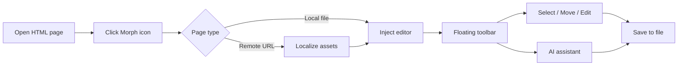

<p align="center">
  
</p>

<h1 align="center">Morph</h1>

<p align="center">
  <strong>Edit any HTML page like a slide deck.</strong><br />
  A Chrome extension that injects a visual editor directly into live pages — select, drag, edit text, replace images, and refine layouts with AI.
</p>

<p align="center">
  <a href="https://morph-longdz6299-7110s-projects.vercel.app"></a>
  <a href="https://github.com/jimuzhe/morph"></a>
  
  
</p>

<p align="center">
  <a href="https://morph-longdz6299-7110s-projects.vercel.app">Website</a>
  &nbsp;&middot;&nbsp;
  <a href="#installation">Install</a>
  &nbsp;&middot;&nbsp;
  <a href="#development">Development</a>
  &nbsp;&middot;&nbsp;
  <a href="https://github.com/jimuzhe/morph/issues">Issues</a>
</p>

<br />

## Overview

Morph is not a standalone web app. It is a **page-native editor** — a floating toolbar injected into whatever HTML page you already have open.

| Context | Flow |
| --- | --- |
| Local `.html` files | Open in Chrome → activate Morph → edit in place → save back to disk |
| Live webpages | Activate Morph → page is localized into an editable copy → edit → export as HTML |

No DevTools panels. No separate canvas. The page itself becomes the workspace.

<br />

## How It Works



<br />

## Features

<table>
  <tr>
    <td width="50%" valign="top">
      <h3>Slide-like editing</h3>
      <p>Open any HTML file or webpage and edit visually on the page itself. Select elements, drag to reposition, resize, and double-click to change copy.</p>
    </td>
    <td width="50%" valign="top">
      <h3>Glassmorphism toolbar</h3>
      <p>An iOS-inspired floating capsule sits at the bottom of the viewport — draggable, edge-snappable, and collapsible into a compact orb when you need more space.</p>
    </td>
  </tr>
  <tr>
    <td width="50%" valign="top">
      <h3>AI assistant in context</h3>
      <p>Describe changes in plain language. Morph applies HTML edits directly on the page, scoped to the element you select, with full undo support.</p>
    </td>
    <td width="50%" valign="top">
      <h3>Local-first workflow</h3>
      <p>Local files save back to their original path. Remote pages are localized first, then exported as standalone HTML with Cmd/Ctrl+S.</p>
    </td>
  </tr>
</table>

<br />

## Toolbar

| Tool | Action |
| --- | --- |
| Select & Move | Click to select, drag to reposition |
| Edit Text | Double-click or select, then edit inline |
| Replace Image | Upload a local file to swap the selected image |
| Undo / Redo | Full history stack |
| Save | Write changes to the local HTML file |
| Exit | Leave edit mode |

<br />

## Installation

```bash
git clone https://github.com/jimuzhe/morph.git
cd morph
npm install
npm run build
```

1. Open Chrome and navigate to `chrome://extensions`
2. Enable **Developer mode**
3. Click **Load unpacked** and select the `dist/` directory
4. In the extension details, enable **Allow access to file URLs** (required for local HTML editing)
5. Open any HTML file or webpage in Chrome
6. Click the Morph icon — the toolbar appears at the bottom of the page

<br />

## Keyboard Shortcuts

| Shortcut | Action |
| --- | --- |
| `Ctrl/Cmd + Z` | Undo |
| `Ctrl/Cmd + Y` | Redo |
| `Ctrl/Cmd + S` | Save |
| `Esc` | Exit edit mode / cancel text editing |
| `Delete` | Remove selected element |

<br />

## Project Structure

```
morph/
├── src/
│   ├── background/serviceWorker.ts   # Toggle edit mode on icon click
│   ├── content/
│   │   ├── index.ts                  # Content script entry
│   │   ├── PageEditor.ts             # In-page editing engine
│   │   ├── FloatingToolbar.ts        # Glassmorphism toolbar
│   │   ├── AIChatPanel.ts            # AI assistant panel
│   │   └── styles.css                # Editor & selection styles
│   └── shared/
│       ├── htmlDocument.ts           # HTML serialization & localization
│       └── fileSave.ts               # Local file export
├── site/                             # Next.js marketing site
├── icons/                            # Extension icon set
├── public/                           # Shared static assets
└── scripts/
    ├── package.mjs                   # Extension zip packaging
    └── generate-icons.py             # Icon generation from master source
```

<br />

## Marketing Site

The landing page lives in `site/` — a Next.js app with scroll-driven motion, bento feature cards, and a cinematic download section.

```bash
cd site
npm install
npm run dev      # http://localhost:3000
npm run build    # production build
```

Deployed on Vercel with `site/` as the root directory.

<br />

## Development

```bash
# Extension — watch mode
npm run dev
# Reload the unpacked extension in chrome://extensions after changes

# Package for distribution
npm run package
```

<details>
  <summary><strong>Icon generation</strong></summary>

  <br />

  Regenerate extension and site icons from the master source:

  ```bash
  python3 scripts/generate-icons.py
  ```

  Requires `Pillow`. Output is written to `icons/`, `public/`, and `site/public/`.

</details>

<br />

## License

MIT
